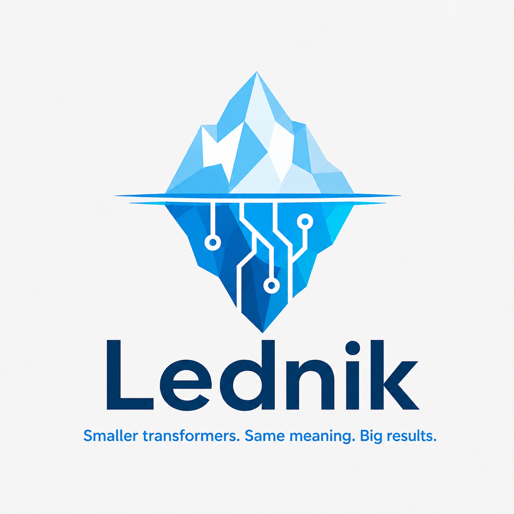

<p align="center">
  
</p>

# Lednik

**Lednik** is a full-cycle framework for distilling large transformer encoders into small,
fast embedding models — and for proving, with numbers, how much cheaper they are to run.

Large embedding models like [`deepvk/USER-bge-m3`](https://huggingface.co/deepvk/USER-bge-m3)
(359M parameters) deliver great quality but are expensive to serve: a single mid-range GPU
saturates at a few hundred requests per second, and long inputs make the quadratic attention
cost explode. Lednik attacks this from the model side: it initializes a compact student from
the teacher's own embedding space, distills the teacher's knowledge into it, and ships the
result with a serving stack and a benchmark suite that measures quality (RuMTEB), raw
forward-pass speed, and end-to-end throughput under load.

Three student tiers cover the quality/cost trade-off:

- **Static Embeddings** — a weighted token lookup table. No attention, no context, near-zero
  compute; runs comfortably on CPU.
- **Lednik Transformer (full attention)** — a tiny encoder (RoPE, RMSNorm, Liger
  SwiGLU/GeGLU, gated attention) with a fully unpadded varlen fast path
  (Flash-Attention 2 / torch varlen SDPA).
- **Lednik Transformer (hybrid)** — the same encoder with part of the layers replaced by
  **bidirectional Gated DeltaNet** (linear attention on
  [flash-linear-attention](https://github.com/fla-org/flash-linear-attention) kernels):
  linear instead of quadratic scaling with sequence length.

## Results

Quality on the Russian subset of MTEB (RuMTEB) versus pure forward-pass speed
(bfloat16, RTX 3080, batch of 8 sequences of 128–4096 tokens, ~10.9k real tokens per batch,
`triton.testing.do_bench` median):

| Model | Params | RuMTEB AvgScore | Forward median | Tokens/sec |
| --- | ---: | ---: | ---: | ---: |
| USER-bge-m3 (teacher, sdpa) | 359.0M | 0.601 | 568.6 ms | 19.1k |
| Lednik Transformer — hybrid GDN (varlen) | 59.0M | 0.497 | 42.3 ms | 252.8k |
| Lednik Transformer — full attention (varlen) | 56.0M | 0.490 | 31.0 ms | 349.4k |
| Static Embeddings | 17.8M | 0.421 | 0.32 ms | 32.3M |

The transformer students keep ~82% of the teacher's RuMTEB score at **6× fewer parameters
and 13–18× faster forward**; the static model trades another chunk of quality for a
practically free forward pass. The hybrid's linear-attention advantage grows with sequence
length — at the 128–4096 range above the full-attention student is still ahead.

Raw records live in [`bench/mteb_testing/results/`](./bench/mteb_testing/results) and
[`bench/forward_testing/results/`](./bench/forward_testing/results).

## Features

- **Initialization factory** — seed a student from a teacher: sweep the vocabulary through
  the teacher, pool per-token embeddings, PCA them down to the student width, optionally
  weight by Smooth Inverse Frequency (SIF).
- **Distillation** — contrastive + regression objective on teacher/student sentence
  embeddings; either a pure-Python Lightning loop or a full ClearML pipeline with artifact
  loading, config syncing, remote queues and online validation (Redis + Qdrant).
- **Flexible student architecture** — the layer stack is a config list mixing
  `full-attention`, `gated-delta-net` (bidirectional GDN) and `moba` blocks; gated
  attention, Liger kernels, fully unpadded varlen inference.
- **`AutoLednikModel`** — one entry point that loads any Lednik checkpoint (HF directory or
  Lightning `.ckpt`) by resolving the architecture from its config via the model registry.
- **Serving** — a [LitServe](https://github.com/Lightning-AI/LitServe)-based embedding
  server with dynamic batching, multiple inference workers and HTTP API processes, ZMQ
  transport, and a benchmark-oriented request protocol (raw texts or pre-tokenized ids).
- **Benchmark suite** — RuMTEB quality runs, pure forward-pass measurements
  (`do_bench` + VRAM + tokens/sec), and an open-loop/closed-loop HTTP load generator.

## Documentation

Full guides live in [`docs/`](./docs):

- **[Model Initialization](./docs/model_initialization.md)** — create a student from a
  teacher (the architectures, factory functions, configs, save/reload, inference).
- **[Training without ClearML](./docs/training_without_clearml.md)** — build the config,
  instantiate the training module, the collator data format, and a minimal `Trainer` loop.
- **[Training with ClearML](./docs/training_with_clearml.md)** — the `pipelines/distill/`
  pipeline: checkpoint loading, config/dataset wiring, checkpoint uploads, remote queues,
  the online validation worker, and MTEB benchmarking.
- **[Usage](./docs/usage.md)** — using trained models: checkpoint loading with
  `AutoLednikModel`, the LitServe server, the request protocol, scaling knobs and Docker
  deployment.

## Project structure

```
lednik/
├── lednik/                  # core library
│   ├── initialization/      # model factory (create_* fns), PCA, tokenizer utils
│   ├── models/              # LednikModel, StaticEmbeddingsModel, configs, outputs,
│   │                        #   AutoLednikModel + model/config registries
│   ├── distill/             # DistillationModule, collator, configs, losses, validation
│   ├── serving/             # LitServe embedding server (lednik.serving.server)
│   ├── emb_utils.py         # teacher embedding extraction & pooling
│   ├── dist_utils.py        # FSDP/DDP helpers, distributed embedding gather
│   └── path_utils.py        # determine_path: ClearML ID / HF repo / local path resolver
├── pipelines/distill/       # ClearML + Lightning distillation pipeline
├── bench/
│   ├── mteb_testing/        # RuMTEB benchmark runner + model wrapper
│   ├── forward_testing/     # pure forward-pass bench (do_bench, VRAM, tokens/sec)
│   └── load_testing/        # open-/closed-loop HTTP load generator
├── docker/                  # serving / training / flash-attention builder images
├── docker-compose.yaml      # serving, training, qdrant, redis services
├── configs/                 # YAML configs (training_settings / worker)
├── eda_utils/               # synthetic data generation utilities
├── figs/                    # logo and figures
├── kostyl_toolkit/          # git submodule: the `kostyl` ML toolkit (used throughout)
└── docs/                    # documentation
```

> **`kostyl`.** Lednik depends on **kostyl-toolkit**, the author's personal ML toolkit,
> vendored as the [`kostyl_toolkit/`](./kostyl_toolkit) git submodule and installed as
> `kostyl-toolkit[ml]`. Every `kostyl.*` import resolves to it.

## Installation

```bash
# Clone with the kostyl submodule
git clone --recurse-submodules <repo-url>
# or, if already cloned:
git submodule update --init --recursive

# Install with uv (the project's package manager)
uv sync                       # core + default groups (dev, distill)
uv sync --group flash-attn    # optional: Flash-Attention + fla kernels for GPU inference
uv sync --group bench         # optional: MTEB benchmarking
uv sync --group serving       # optional: LitServe server
```

Python ≥ 3.13 is required (see [`pyproject.toml`](./pyproject.toml)).

## Quickstart

Initialize a Lednik Transformer student from a teacher:

```python
from transformers import AutoModel, AutoTokenizer
from lednik.models import LednikConfig
from lednik.initialization.factory import create_lednik_transformer

teacher = AutoModel.from_pretrained("deepvk/USER-bge-m3").to("cuda").eval()
tokenizer = AutoTokenizer.from_pretrained("deepvk/USER-bge-m3")

config = LednikConfig(
    hidden_size=384,
    num_attention_heads=6,
    intermediate_size=1152,
    # the layer stack is explicit: mix full attention with linear-attention blocks
    layers=["full-attention", "gated-delta-net", "full-attention"],
    rope_parameters={"rope_type": "default", "rope_theta": 10000.0},
)

student = create_lednik_transformer(
    model=teacher,
    tokenizer=tokenizer,
    model_config=config,
    pooling="mean",
    embedding_extraction_batch_size=256,
)
student.save_pretrained("weights/lednik_base")
tokenizer.save_pretrained("weights/lednik_base")
```

Then distill it — see [Training without ClearML](./docs/training_without_clearml.md) for the
pure-Python loop, or run the ClearML pipeline:

```bash
python -m pipelines.distill.run                              # local
python -m pipelines.distill.run --remote-execution-queue q   # remote ClearML agent
```

Load any trained checkpoint back without knowing its concrete class:

```python
from lednik.models import AutoLednikModel

# works for HF-format directories and Lightning .ckpt files alike;
# the class is resolved from the checkpoint config via the model registry
model = AutoLednikModel.from_pretrained(
    "weights/lednik_base", weights_prefix="student.", strict_prefix=True
)
```

## Serving

The serving stack lives in [`lednik/serving/server.py`](./lednik/serving/server.py) and is
deployed via Docker Compose:

```bash
docker compose --profile serving build serving
docker compose --profile serving up -d
```

Configuration goes through `.env` (`SERVING_MODEL`, `SERVING_TOKENIZER`,
`SERVING_MAX_BATCH_SIZE`, `SERVING_BATCH_TIMEOUT`, `SERVING_NUM_WORKERS`,
`SERVING_NUM_API_SERVERS`, `SERVING_FAST_QUEUE`, `SERVING_MAX_SEQ_LENGTH`). Model and
tokenizer references accept a local path, a ClearML model ID, or an HF Hub repo id.
See [Usage](./docs/usage.md) for the request protocol and scaling knobs.

## Models

- **`LednikModel`** — a compact encoder built from an explicit per-layer stack
  (`config.layers`): `full-attention` blocks (RoPE, optional attention gating, Liger
  SwiGLU/GeGLU MLP), bidirectional **`gated-delta-net`** blocks (linear attention on fla
  Triton kernels), and experimental `moba` blocks (mixture of block attention). Supports
  `eager`, `sdpa` (torch varlen), `flash_attention_2` and `flash_attention_4`
  implementations; the varlen backends run a fully unpadded path driven by
  `cu_seqlens`/`max_seqlen` derived from the attention mask. Returns `last_hidden_state`
  and mean-pooled `sentence_embeddings`.
- **`StaticEmbeddingsModel`** — maps tokens directly to static vectors with per-token SIF
  weights, RMSNorm and mean pooling; no attention. Ideal for ultra-low-latency / CPU
  inference. A `StaticEmbeddingsForSequenceClassification` head is also available.
- **`AutoLednikModel`** — resolves the concrete class from a checkpoint's
  `architectures` via the `@register_model` / `@register_config` registries and loads
  HF directories or Lightning `.ckpt` files (with `weights_prefix` filtering for
  distillation checkpoints).
