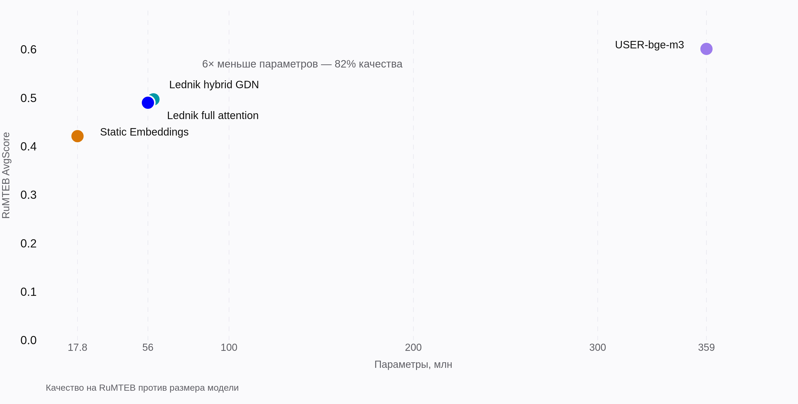

# Data Science

Task: compress [`deepvk/USER-bge-m3`](https://huggingface.co/deepvk/USER-bge-m3) (359M
parameters) into students small enough to serve cheaply, losing as little embedding
quality as measurable. Everything below is measured; raw records are committed in
[`bench/*/results/`](../../bench).

## Method

### Initialization: students start in the teacher's embedding space

Random init wastes the first chunk of training on rediscovering token semantics the
teacher already has. Instead, the factory
([`lednik/initialization/`](../../lednik/initialization), guide:
[model initialization](../model_initialization.md)) runs the whole vocabulary through the
teacher, pools per-token hidden states, reduces them to the student width with PCA (the
explained-variance ratio is logged, so the information lost to the projection is known),
and seeds the student's embedding table with the result. For the static model, tokens
additionally get Smooth Inverse Frequency weights.

### Student architectures

| Student                            | Params | Structure                                                                                                                                                                                                                |
| ---------------------------------- | -----: | ------------------------------------------------------------------------------------------------------------------------------------------------------------------------------------------------------------------------ |
| Static Embeddings                  |  17.8M | 384-dim token lookup table with SIF weights, RMSNorm, mean pooling. No attention.                                                                                                                                        |
| Lednik Transformer, full attention |    56M | 7 blocks, hidden 576: RoPE, gated attention, Liger SwiGLU, fully unpadded varlen path (Flash-Attention 2 / torch varlen SDPA).                                                                                           |
| Lednik Transformer, hybrid         |    59M | Same skeleton with several blocks swapped for bidirectional Gated DeltaNet (linear attention,[fla](https://github.com/fla-org/flash-linear-attention) kernels) — linear instead of quadratic scaling in sequence length. |

The layer stack is an explicit list in the config (`layers: ["full-attention", "gated-delta-net", ...]`), so architecture search is a config edit, not a code change. An
experimental `moba` (mixture of block attention) block type exists behind the same
interface.

### Distillation objective

Teacher sentence embeddings are precomputed offline; the teacher never runs during
training. The loss ([`training_module.py`](../../lednik/distill/training_module.py)) is

```
loss = w · InfoNCE(query, positive [, hard negatives])  +  (1 − w) · cosine(student → teacher)
```

with `w = 0.7`, temperature 0.07 — in-batch contrastive learning shapes the space, the
regression term anchors it to the teacher (repo config:
[`configs/training_settings.yaml`](../../configs/training_settings.yaml)). Training
details: AdamW8bit, plateau-with-cosine-annealing LR schedule, bf16, DDP; the student
embedding table stays frozen for the first 10% of steps so early gradients don't destroy
the initialization.

### Data and augmentation

Training data are query–positive pairs (optionally with hard negatives) stored as
tokenized text plus precomputed teacher vectors in versioned ClearML datasets; the exact
row format is documented in
[training without ClearML → collator contract](../training_without_clearml.md#2-data-format-the-collator-contract).
35% of training rows are corrupted with realistic typos
([SAGE](https://github.com/ai-forever/sage) SBSC, ≥5 typos per text) and re-tokenized on
the fly, while the target stays the teacher's embedding of the clean text — the student
learns to map noisy user input to clean-text vectors. Validation never uses
augmentation. Part of the pairs is synthetic, generated by an LLM through
[`eda_utils/synt_generation`](../../eda_utils/synt_generation).

## Validation during training

Loss curves alone don't show whether an embedding space is degrading, so every
validation epoch also computes embedding-quality metrics on the val split: KNN accuracy
and a logistic-regression probe over labeled classes, MRR for retrieval (Qdrant), and a
PaCMAP projection for visual inspection. Validation frequency is a trainer setting
(`val_check_interval`, up to several validation epochs per training epoch); the metrics
are dispatched to a separate worker over Redis, or executed in-process when no Redis is
configured, and land in the ClearML task as scalars (details:
[training with ClearML → online validation](../training_with_clearml.md#8-online-validation)).

## Results

Setup for all tables: single RTX 3080, bfloat16. Quality and speed are measured
independently by three suites: RuMTEB for quality, `do_bench` forward passes for raw
speed, an open-loop HTTP load generator for served throughput.

### Quality: RuMTEB

From [`bench/mteb_testing/results/metrics.jsonl`](../../bench/mteb_testing/results/metrics.jsonl)
(per-task-type scores included there):

| Model                 | Params | AvgScore | vs teacher | Retrieval |   STS | Classification |
| --------------------- | -----: | -------: | ---------: | --------: | ----: | -------------: |
| USER-bge-m3 (teacher) |   359M |    0.601 |       100% |     0.622 | 0.776 |          0.623 |
| Lednik hybrid GDN     |    59M |    0.497 |        83% |     0.449 | 0.663 |          0.520 |
| Lednik full attention |    56M |    0.490 |        81% |     0.423 | 0.662 |          0.521 |
| Static Embeddings     |  17.8M |    0.421 |        70% |     0.291 | 0.599 |          0.476 |



Retention is uneven across task types: STS and classification keep ~85%, retrieval keeps
68–72% — fine-grained relevance ranking is where the missing capacity hurts most.

### Speed: forward pass

Batch 8, sequence lengths 128–4096 (~10.9k real tokens per batch), medians from
`triton.testing.do_bench`
([`bench/forward_testing/results/metrics.jsonl`](../../bench/forward_testing/results/metrics.jsonl)):

| Model                 | Mode          |   Median | Tokens/s | vs teacher |
| --------------------- | ------------- | -------: | -------: | ---------: |
| USER-bge-m3 (teacher) | padded, sdpa  | 568.6 ms |    19.1k |        1× |
| Lednik full attention | padded, eager | 377.1 ms |    28.6k |      1.5× |
| Lednik full attention | varlen, FA2   |  31.0 ms |   349.4k |     18.3× |
| Lednik hybrid GDN     | varlen, FA2   |  42.3 ms |   252.8k |     13.3× |
| Static Embeddings     | —            |  0.32 ms |    32.3M |    ~1700× |

The padded-eager row isolates the contribution of inference engineering: the same 56M
weights run 12× faster on the fully unpadded varlen path than naively. Shrinking the
model without that path would have left most of the speedup on the table.

### Load testing the served model

Open-loop generator, 500 requests, ~2.3k tokens per request, pre-tokenized payloads
([`bench/load_testing/results/metrics.jsonl`](../../bench/load_testing/results/metrics.jsonl)):

| Model                 | Offered load | Sustained |  Errors |    p50 |    p99 |
| --------------------- | -----------: | --------: | ------: | -----: | -----: |
| USER-bge-m3 (teacher) |        5 rps |   5.0 rps |       0 |  38 ms | 274 ms |
| USER-bge-m3 (teacher) |       10 rps |   7.4 rps |       0 | 104 ms | 18.5 s |
| Lednik full attention |      100 rps |  99.0 rps |       0 |  45 ms | 216 ms |
| Lednik hybrid GDN     |      100 rps |   4.3 rps | 348/500 | 29.4 s | 29.5 s |

The teacher's capacity on this GPU is ~5 rps: at 10 rps the queue grows without bound
and p99 reaches 18.5 s. The full-attention student sustains a 20× higher request rate
with lower p99 than the teacher had at 5 rps.

## Findings and limitations

- **The hybrid wins on quality but not yet in serving.** It scores +0.007 AvgScore over
  full attention, but is 1.36× slower on the ≤4k profile (linear-attention kernels pay
  fixed overhead at short lengths) and its serving path collapsed under the 100-rps run
  (348/500 errors). Full attention is the serving default; the hybrid's payoff is long
  sequences, where quadratic attention stops fitting the latency budget.
- **Positions.** Students are trained with `max_position_embeddings = 768`; longer
  inputs run on RoPE extrapolation. Long-context quality needs rope scaling / a larger
  theta — planned.
- **Retrieval is the weakest transfer.** For quality-critical ranking, the practical
  setup is student recall + teacher reranking of the top-k
  (see [product.md](./product.md)).
- **The static tier is for recall, not ranking**: 70% average retention but 0.29 on
  retrieval. Candidate generation, dedup and clustering on CPU are its use cases.
- **Scope of the numbers.** One GPU model (RTX 3080), one run per configuration, no
  variance estimates; multi-GPU cost projections assume linear horizontal scaling.

## Reproducing

```bash
uv sync --group bench                               # + --group serving for load tests
uv run python -m bench.mteb_testing.run --help      # RuMTEB, ClearML or HF models
uv run python -m bench.forward_testing.run --help   # do_bench latency / VRAM / tokens-per-sec
uv run python -m bench.load_testing.run --help      # open-/closed-loop HTTP load
```

Each run appends a JSON line with its full setup (GPU, batch, sequence lengths, seed) to
the suite's `results/metrics.jsonl`.
