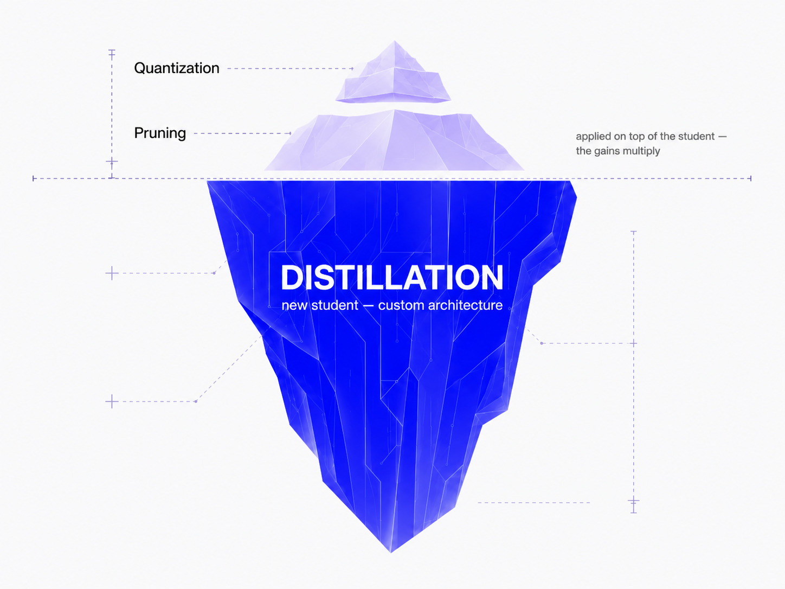
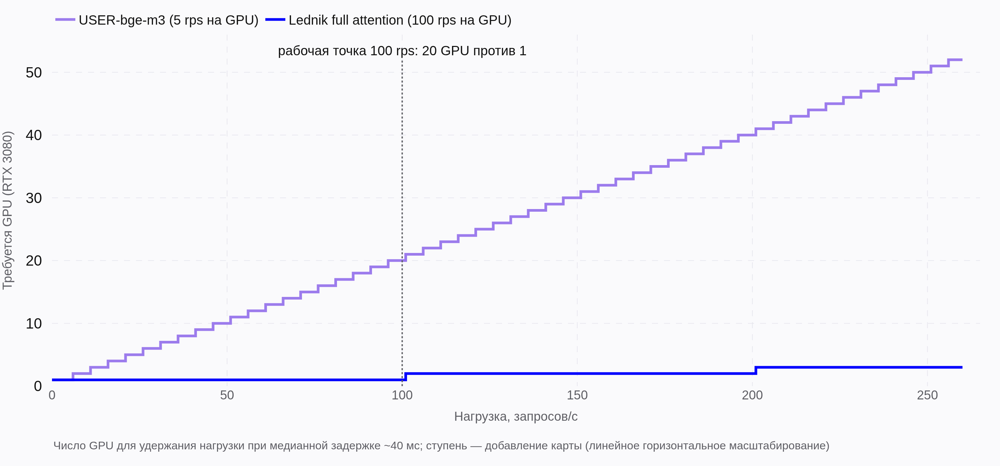
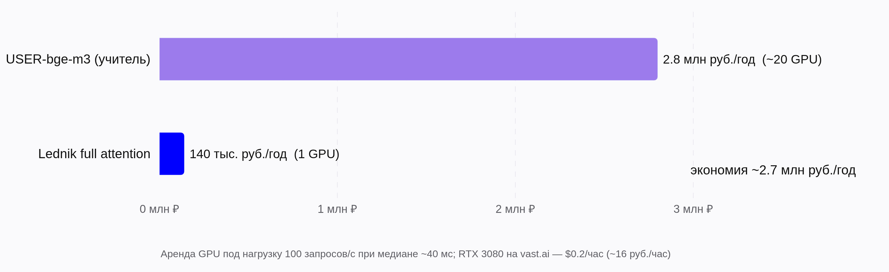
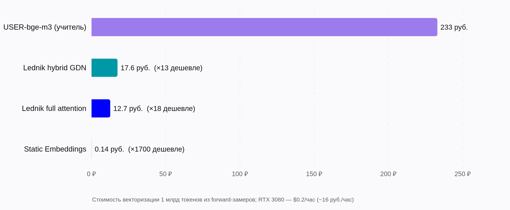

# Product

## Problem

Semantic search, RAG and deduplication over Russian text run on embedding models, and at
self-hosted scale the encoder is a standing GPU bill: every query is embedded online,
and the whole corpus is re-embedded on every model update. Good open encoders are large —
[`deepvk/USER-bge-m3`](https://huggingface.co/deepvk/USER-bge-m3) (359M parameters)
sustains ~5 requests/s on an RTX 3080 at realistic ~2.3k-token payloads
([measured](./data_science.md#load-testing-the-served-model)). At a 100 rps working
point that is ~20 GPUs for the encoder alone.

## Who it is for

Teams that run embedding inference on their own GPUs: product search, RAG over internal
documents, dedup/clustering of large corpora — anywhere sending data to an external API
is not an option or per-token pricing does not survive corpus scale. The framework is
teacher-agnostic: any encoder that returns hidden states can be distilled, including a
teacher already fine-tuned on the team's domain.

## Why distillation, and not something else

| Alternative | What it costs |
| --- | --- |
| Keep serving the teacher | 18× the compute per token, ~20× the GPUs at the same rps (measured below). |
| Off-the-shelf small model (rubert-tiny2, model2vec/potion) | A fixed public model: not aligned to your teacher's embedding space, no path to follow a domain-tuned or upgraded teacher. Lednik's static tier plays in this class, produced by the same pipeline. |
| Hosted embedding API | Data leaves the perimeter; per-token pricing against a corpus measured in billions of tokens. |
| Quantization / pruning of the teacher | Compatible, not competing: both apply to the student too, and the gains multiply. Distillation sets the parameter count; they shave the rest. |

## What is built

The full loop, not a checkpoint: initialize a student from any teacher → distill
(plain Lightning or the ClearML pipeline with registry, remote queues and online
validation) → serve (LitServe server, Docker Compose) → measure (RuMTEB quality,
forward-pass speed, HTTP load). Three student tiers from one pipeline:

| Tier | Params | Quality (RuMTEB avg) | Use |
| --- | ---: | ---: | --- |
| Static Embeddings | 17.8M | 0.421 (70%) | CPU-friendly candidate generation, dedup, clustering. |
| Full attention | 56M | 0.490 (81%) | Serving default: 100 rps on one RTX 3080, p99 216 ms. |
| Hybrid GDN | 59M | 0.497 (83%) | Long inputs: linear scaling in sequence length. |

Where the quality gap matters (retrieval is the weakest transfer, 68–72% retention), the
cascade works: the student embeds everything and retrieves candidates, the teacher
reranks the top-k. The teacher then processes k documents per query instead of the
corpus.

## Measured impact

Cost basis: rented RTX 3080 at $0.2/hour (~16 ₽/hour, vast.ai). Numbers derive from the
committed benchmark records.

- **Serving, 100 rps working point:** ~20 GPUs for the teacher (5 rps each) vs 1 for the
  student — 2.8M ₽/year vs 140k ₽/year, ~2.7M ₽/year difference.
- **Offline vectorization, per billion tokens:** teacher 233 ₽ → hybrid 17.6 ₽ (13×) →
  full attention 12.7 ₽ (18×) → static 0.14 ₽ (~1700×).

## Direction

- A TileLang kernel for bidirectional GDN and hardening the hybrid's serving path (it
  currently degrades under high load — see
  [findings](./data_science.md#findings-and-limitations)).
- Long-context students: rope scaling past the current 768 trained positions, plus a
  sequence-length sweep to chart where the hybrid overtakes full attention.
- Distilling from LLM-based teachers (LLM → encoder), reusing the same pipeline.
